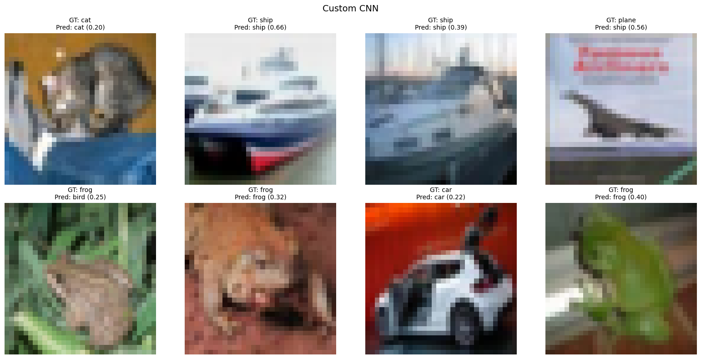

# Image Classification on CIFAR-10 (CNN vs Transfer Learning)

This project compares a **custom-built CNN** with **state-of-the-art pretrained models**
(**ResNet50, VGG16, DenseNet121**) on the **CIFAR-10** dataset using **PyTorch**.

The goal of this project is to demonstrate:
- Baseline CNN performance
- The impact of transfer learning
- Quantitative and qualitative comparison of models

---

## 📊 Dataset
- **CIFAR-10**
- 60,000 RGB images (32×32)
- 10 classes:
  airplane, automobile, bird, cat, deer, dog, frog, horse, ship, truck
- Split:
  - 50,000 training images
  - 10,000 test images

---

## 🧠 Models Compared

| Model | Description |
|------|------------|
| Custom CNN | Simple CNN trained from scratch (baseline) |
| ResNet50 | Deep residual network (ImageNet pretrained) |
| VGG16 | Deep convolutional network with uniform architecture |
| DenseNet121 | Dense connectivity between layers |

All pretrained models were fine-tuned by replacing the final classification layer.

---

## ⚙️ Training Setup
- Framework: **PyTorch**
- Loss Function: **CrossEntropyLoss**
- Optimizer: **SGD** (lr = 0.001, momentum = 0.9)
- Batch Size: **64**
- Epochs: **5**
- Best model selected based on **test accuracy**
- Device: **GPU if available, otherwise CPU**

---

## 📈 Quantitative Results (Test Accuracy)


| Model | Best Test Accuracy |
|------|------------------|
| VGG16 | ~88–89% |
| DenseNet121 | ~83–84% |
| ResNet50 | ~83–84% |
| Custom CNN | ~44% |

**Observation:**  
Transfer learning significantly outperforms the custom CNN under the same training conditions.

---

## 🖼️ Qualitative Results (Prediction Visualization)

The same test images were used for all models to enable fair visual comparison.

### VGG16 Predictions


### ResNet50 Predictions


### Custom CNN Predictions


**Observations:**
- Pretrained models produce confident and accurate predictions
- The custom CNN struggles with visually similar classes
- Confidence scores clearly reflect model reliability

---

## 💾 Model Saving
- The **best-performing model per architecture** is saved automatically
- Checkpoints are stored locally and excluded from Git:

```
checkpoints/
├── custom_cnn_cifar10.pth
├── resnet50_cifar10.pth
├── vgg16_cifar10.pth
└── densenet121_cifar10.pth
```

Models can be reloaded later without retraining.

---

## ▶️ How to Run

```bash
pip install -r requirements.txt
jupyter notebook src.ipynb
```

Run all cells to train the models, generate plots, and visualize predictions.

---

## 🧪 Key Takeaways
- Transfer learning is highly effective for small image datasets
- Deeper architectures generalize better even with limited training
- Visual inspection complements numerical evaluation

---

## 🔮 Future Improvements
- Data augmentation
- Learning rate scheduling
- Confusion matrix analysis
- Grad-CAM visual explanations
