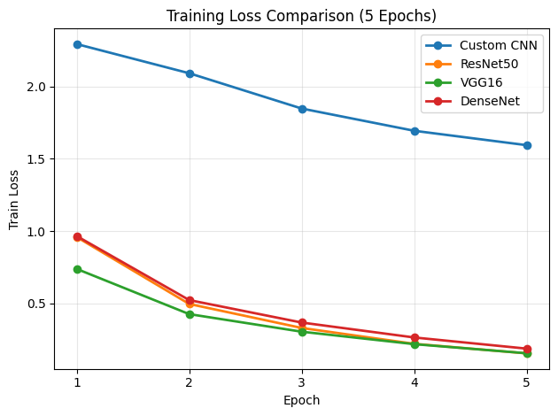

# CIFAR-10 Model Comparison (PyTorch)

This project compares multiple **Convolutional Neural Network (CNN)** architectures on the **CIFAR-10 image classification dataset** using **PyTorch**.  
The goal is to evaluate and compare model performance under the same training setup.

---

## 🔍 Models Compared

- **Custom CNN** (trained from scratch)
- **ResNet50** (pretrained, transfer learning)
- **VGG16** (pretrained, transfer learning)
- **DenseNet121** (pretrained, transfer learning)

All models were trained for **5 epochs** using the same optimizer, loss function, and dataset split.

---

## Results

### Test Accuracy Comparison


### Training Loss Comparison


### Results Table

| Model        | Epochs | Final Test Acc (%) | Best Test Acc (%) | Final Train Loss | Best Epoch |
|-------------|--------|--------------------|------------------|------------------|------------|
| VGG16       | 5      | 86.61              | 87.49            | 0.1540           | 4          |
| DenseNet121 | 5      | 83.21              | 83.67            | 0.1862           | 4          |
| ResNet50    | 5      | 82.45              | 82.77            | 0.1533           | 3          |
| Custom CNN  | 5      | 44.00              | 44.00            | 1.5947           | 5          |


## 🧠 Dataset

- **CIFAR-10**
  - 60,000 RGB images (32×32)
  - 10 classes
  - 50,000 training images / 10,000 test images
- Images are normalized and loaded using PyTorch `DataLoader`.

---

## ⚙️ Training Setup

- Framework: **PyTorch**
- Loss Function: **CrossEntropyLoss**
- Optimizer: **Adam**
- Batch Size: **64**
- Device: **GPU if available, otherwise CPU**
- Evaluation performed after each epoch

---

## 🚀 How to Run

```bash
pip install torch torchvision matplotlib
jupyter notebook CIFAR10_Model_Comparison_epoch_print_and_summary.ipynb
```

Run all cells to train the models and generate comparison plots.

---

## 🎯 Key Takeaways

- Transfer learning models significantly outperform the custom CNN
- VGG16 achieved the highest test accuracy in this setup
- The custom CNN serves as a baseline and highlights the benefit of deeper pretrained architectures

---

### 📁 Suggested Repository Structure

```
cifar10-model-comparison/
├── CIFAR10_Model_Comparison_epoch_print_and_summary.ipynb
├── README.md
└── images/
    └── accuracy_comparison.png
```
